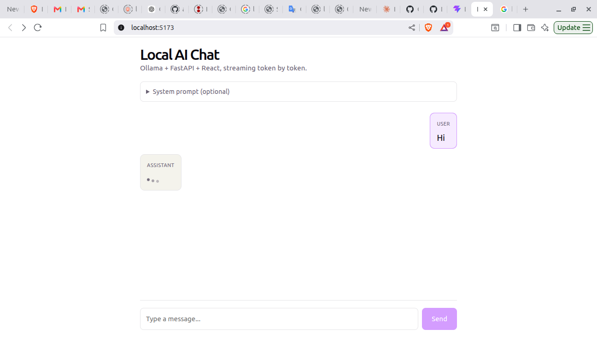
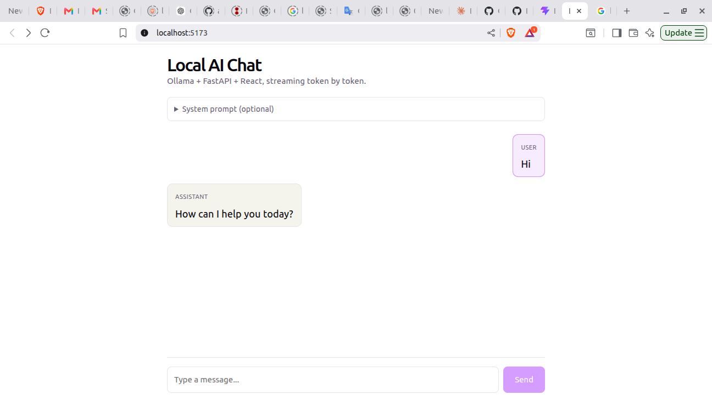

# Local AI Integration Stack — Streaming Chat UI

[](https://github.com/aizencse358/local-ai-stack/actions/workflows/ci.yml)

A foundational project for learning how local LLMs, a backend server, and a
frontend UI wire together end-to-end.

## Stack

- **Ollama** — local LLM runtime
- **FastAPI** — backend middleware (prompts, streaming, context)
- **React + TypeScript (Vite)** — frontend chat UI (token-by-token rendering)

## Milestone 1: Streaming Chat UI

React sends a message to FastAPI, FastAPI forwards it to Ollama and streams
the response back over Server-Sent Events (SSE), and React renders tokens
as they arrive.

| Waiting for a response | Streamed response |
| --- | --- |
|  |  |

## Running with Docker

```bash
docker compose up --build
```

Then pull a model into the running Ollama container:

```bash
docker compose exec ollama ollama pull llama3.2
```

Backend will be available at `http://localhost:8000`, with a health check at
`GET /api/health` and streaming chat at `POST /api/chat`.

## Running the backend locally (without Docker)

Uses [uv](https://docs.astral.sh/uv/) for dependency management.

```bash
cd backend
uv sync
cp .env.example .env
uv run uvicorn app.main:app --reload
```

Requires Ollama running locally on `localhost:11434` with a model pulled
(`ollama pull llama3.2`).

## Running the frontend locally

Requires Node 18+.

```bash
cd frontend
npm install
cp .env.example .env
npm run dev
```

Frontend will be available at `http://localhost:5173` and expects the
backend at `http://localhost:8000` (configurable via `VITE_BACKEND_URL`).

## `POST /api/chat`

```json
{
  "messages": [{ "role": "user", "content": "hello" }],
  "system": "optional system prompt",
  "context": "optional document text for basic Knowledge Q&A",
  "model": "llama3.2"
}
```

`context` is folded into the system message with instructions to answer from
the document (or say so if the answer isn't there) — this powers the
"Document context" field in the UI.

Set `rag: true` to instead retrieve relevant chunks from uploaded documents
(see `POST /api/documents` below) and fold those into the system message.
`context` and `rag` can be combined; each is folded in independently.

Response is `text/event-stream`. When `rag` retrieves results, the first
event is `data: {"sources": [{"filename": ..., "text": ..., "score": ...}, ...]}\n\n`,
followed by token events `data: {"token": "..."}\n\n`, terminated by
`data: [DONE]\n\n`.

## `POST /api/documents`

Multipart upload (`.txt`/`.md`). Chunks the document, embeds each chunk with
`nomic-embed-text` via Ollama, and stores the vectors in a local ChromaDB
collection for retrieval by `/api/chat` when `rag: true`.

```bash
curl -F "file=@notes.md" http://localhost:8000/api/documents
# {"document_id": "...", "filename": "notes.md", "chunk_count": 12}
```

`GET /api/documents` lists indexed documents (`id`, `filename`, `chunk_count`).
`DELETE /api/documents/{document_id}` removes a document and its chunks.

Requires the embedding model to be pulled into Ollama:

```bash
docker compose exec ollama ollama pull nomic-embed-text
```

## Roadmap

- [x] Streaming Chat UI
- [x] System prompt field (persona/instructions)
- [x] Paste document content into system prompt (basic Knowledge Q&A)
- [x] Proper RAG with chunking + embeddings (`nomic-embed-text` + ChromaDB)
